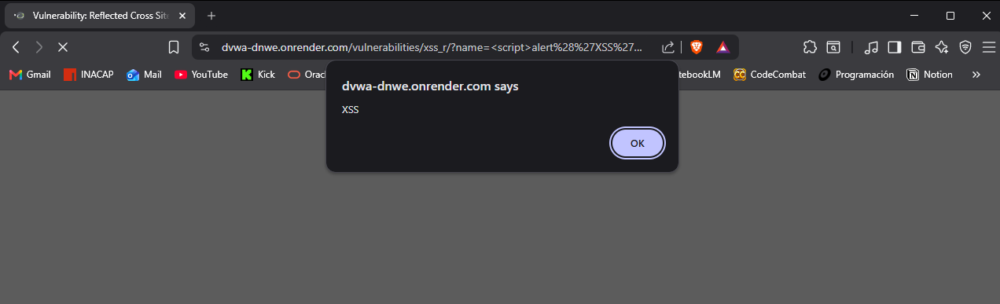

# XSS Reflejado — Cross-Site Scripting

## Evidencia del ataque

El ataque se realizó en el módulo **XSS (Reflected)** de DVWA con nivel de seguridad Low.

**Payload utilizado:** `<script>alert('XSS')</script>`

En el campo "What's your name?" se ingresó el payload anterior. El navegador ejecutó el script y mostró un popup con el mensaje "XSS", demostrando que el código fue interpretado como instrucción y no como texto.



## Por qué funciona

La página toma lo que escribe el usuario y lo inserta directamente en el HTML de respuesta sin sanitizarlo:

```html
<!-- Entrada normal: Pedro -->
<p>Hola Pedro</p>

<!-- Entrada maliciosa -->
<p>Hola <script>alert('XSS')</script></p>
```

El navegador no sabe que `<script>alert('XSS')</script>` vino del usuario — lo ve como parte del código de la página y lo ejecuta. El problema es el mismo de siempre: la aplicación no separa los datos del usuario de sus propias instrucciones.

## Impacto en Aguas Claras Sanitaria

En el portal de clientes de Aguas Claras, esta vulnerabilidad permitiría a un atacante enviar un enlace manipulado a un cliente. Cuando la víctima abre ese enlace, el script malicioso se ejecuta en su navegador y puede robar su cookie de sesión, lo que le daría al atacante acceso completo a la cuenta del cliente. También podría redirigir al usuario a una página falsa para robar sus credenciales o datos de pago.

## Puntaje CVSS


| Métrica                | Valor                |
| ----------------------- | -------------------- |
| Vector de ataque        | Red (Network)        |
| Complejidad             | Baja (Low)           |
| Privilegios requeridos  | Ninguno (None)       |
| Interacción de usuario | Requerida (Required) |
| Confidencialidad        | Alta (High)          |
| Integridad              | Alta (High)          |
| Disponibilidad          | Ninguna (None)       |

**Puntaje CVSS v3.1: 8.2 — Alto**

## Política de prevención

La prevención principal es **escapar la salida**: convertir los caracteres especiales en entidades HTML para que el navegador los muestre como texto y no los ejecute como código.

```php
// VULNERABLE — inserta directo en el HTML
echo "Hola " . $_GET['nombre'];

// SEGURO — escapa los caracteres especiales
echo "Hola " . htmlspecialchars($_GET['nombre'], ENT_QUOTES, 'UTF-8');
```

Con `htmlspecialchars`, el payload `<script>alert('XSS')</script>` se convierte en `&lt;script&gt;alert('XSS')&lt;/script&gt;` y el navegador lo muestra como texto plano.

## Control de mitigación

Además de escapar la salida, Aguas Claras debería:

- Implementar una política **CSP (Content Security Policy)** que restrinja qué scripts pueden ejecutarse en el portal
- Validar y sanitizar toda entrada del usuario en el servidor, no solo en el cliente
- Usar el atributo `HttpOnly` en las cookies de sesión para que no sean accesibles desde JavaScript
- Capacitar al equipo de desarrollo en prácticas de codificación segura
