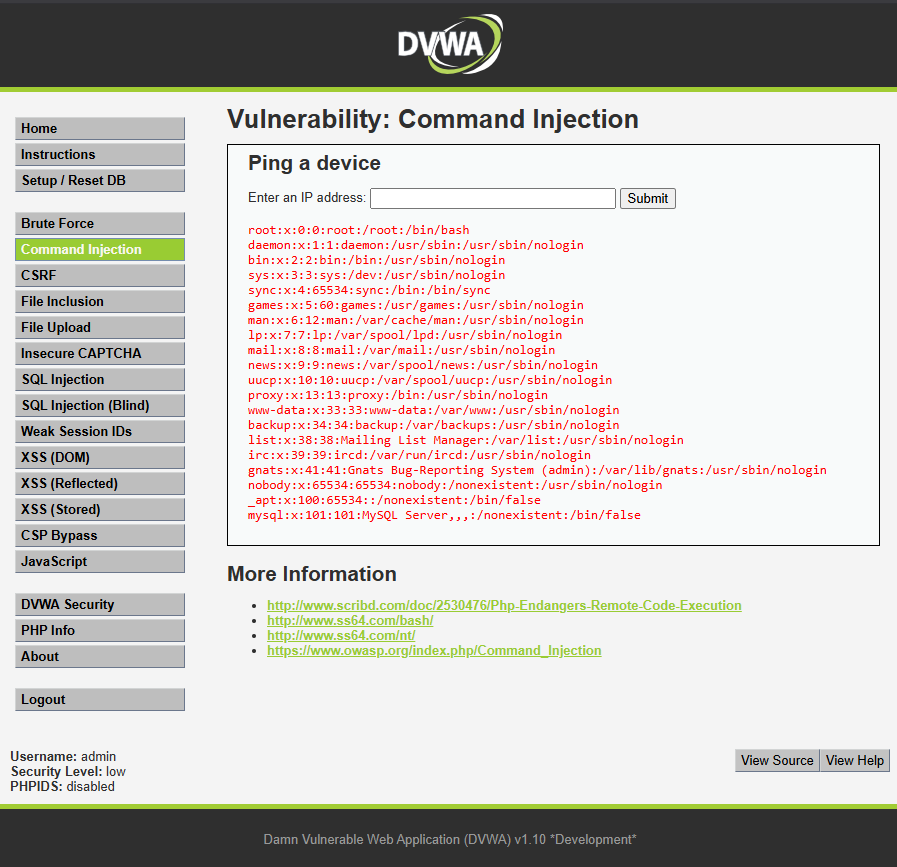

# Inyección de Comandos — Command Injection

## Evidencia del ataque

El ataque se realizó en el módulo **Command Injection** de DVWA con nivel de seguridad Low.

**Payload utilizado:** `127.0.0.1; cat /etc/passwd`

En el campo "Enter an IP address" se ingresó el payload anterior. El servidor ejecutó el ping normal y además mostró el contenido completo del archivo `/etc/passwd`, que lista todas las cuentas de usuario del sistema operativo.



## Por qué funciona

La página ejecuta un ping a la IP que ingresa el usuario. El problema es que pasa esa entrada directamente al sistema operativo sin validarla:

```bash
# Entrada normal
ping -c 4 127.0.0.1

# Entrada maliciosa
ping -c 4 127.0.0.1; cat /etc/passwd
```

El carácter `;` en Linux encadena dos comandos: primero ejecuta el ping y después ejecuta `cat /etc/passwd`. El servidor no distingue que la segunda parte vino del usuario — la ejecuta igual que si fuera una instrucción propia.

## Impacto en Aguas Claras Sanitaria

Esta es la vulnerabilidad más crítica de las tres. En el portal de Aguas Claras, un atacante que logre inyectar comandos tendría control total sobre el servidor. Podría leer archivos internos con datos de clientes, eliminar registros, instalar software malicioso o incluso interrumpir el servicio de facturación y control de distribución. Para una empresa de infraestructura crítica como Aguas Claras, esto podría traducirse en una interrupción del suministro de agua o una fuga masiva de datos personales.

## Puntaje CVSS


| Métrica                | Valor          |
| ----------------------- | -------------- |
| Vector de ataque        | Red (Network)  |
| Complejidad             | Baja (Low)     |
| Privilegios requeridos  | Ninguno (None) |
| Interacción de usuario | Ninguna (None) |
| Confidencialidad        | Alta (High)    |
| Integridad              | Alta (High)    |
| Disponibilidad          | Alta (High)    |

**Puntaje CVSS v3.1: 9.8 — Crítico**

## Política de prevención

La prevención principal es **nunca pasar la entrada del usuario directamente al sistema operativo**. En lugar de construir un comando con lo que escribe el usuario, se deben usar listas blancas que solo acepten valores con formato de IP válida:

```php
// VULNERABLE — ejecuta directo lo que escribe el usuario
$cmd = "ping -c 4 " . $_GET['ip'];
shell_exec($cmd);

// SEGURO — valida que sea una IP antes de ejecutar
$ip = $_GET['ip'];
if (filter_var($ip, FILTER_VALIDATE_IP)) {
    $cmd = "ping -c 4 " . escapeshellarg($ip);
    shell_exec($cmd);
} else {
    echo "IP no válida";
}
```

## Control de mitigación

Además de validar la entrada, Aguas Claras debería:

- Usar APIs seguras que no invoquen la terminal directamente
- Aplicar el principio de mínimo privilegio: el servidor web no debería poder leer archivos del sistema como `/etc/passwd`
- Implementar un sistema de detección de intrusiones (IDS) que alerte sobre comandos sospechosos
- Aislar el servidor web del resto de la infraestructura crítica mediante segmentación de red
